  

        
      
       
      <samp >
      I am a passionate student in India who loves coding and constantly explores new aspects of programming and computers to enhance my knowledge and skills.
      </samp>
  

  <h3 align="left">Connect with me:</h3>
  

    
    
  

## 👨‍💻 Skills 👨‍💻

## 🛠 Tools & Technologies 🛠

## 📊 Some Stats 📊

<picture>
  <source media="(prefers-color-scheme: dark)" srcset="https://streak-stats.demolab.com/?user=Prathamesh-B&count_private=true&theme=react&border_radius=10">
  
</picture>
  
<picture>
  <source media="(prefers-color-scheme: dark)" srcset="https://github-readme-stats.vercel.app/api?username=Prathamesh-B&count_private=true&show_icons=true&theme=react&rank_icon=github&border_radius=10"/>
  
</picture>
  
<picture>
  <source media="(prefers-color-scheme: dark)" srcset="https://github-readme-stats.vercel.app/api/top-langs/?username=Prathamesh-B&langs_count=8&layout=compact&theme=react&border_radius=10&size_weight=0.5&count_weight=0.5">
  
</picture>
  

<picture>
  <source media="(prefers-color-scheme: dark)" srcset="https://chesscom-profile-svg.vercel.app/stats?username=PrathamRex&theme=dark">
  
</picture>

**These Chess Stats are generated using [chesscom-profile-svg](https://github.com/Prathamesh-B/chesscom-profile-svg)**

 

  
  

